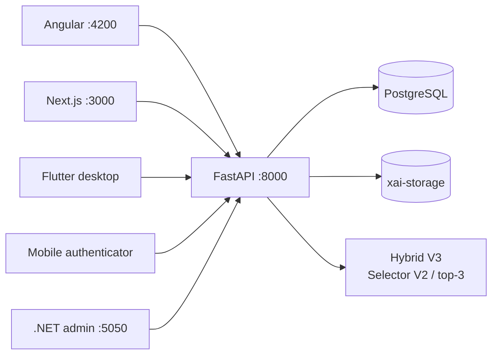

# XAI-Compress integrated platform

This monorepo runs its existing FastAPI backend, PostgreSQL database, Angular portal, Next.js public site, and .NET admin as one Docker Compose platform. Flutter desktop and mobile remain host/device applications and connect to the same exposed API.



## Start and stop

Copy `.env.example` to `.env`, replace its development secrets, then run:

```powershell
.\scripts\start.ps1
```

Equivalent command: `docker compose up --build -d`. Use `scripts/status.ps1`, `scripts/logs.ps1 backend`, and `scripts/stop.ps1` for operations. Do not use `docker compose down -v` when data must be retained.

The server URLs are:

- API and OpenAPI: `http://localhost:8000`, `http://localhost:8000/docs`
- Angular: `http://localhost:4200`
- Next.js: `http://localhost:3000`
- .NET admin: `http://localhost:5050`

PostgreSQL is internal-only at `db:5432`. FastAPI creates the existing SQLAlchemy schema at startup. Named volumes `db-data` and `xai-storage` preserve database records and artifacts across ordinary Compose restarts.

## Runtime configuration

Root `.env.example` documents database credentials, JWT lifetime/secret, ports, browser API URL, CORS origins, and admin email allowlist. Containers use `backend` and `db` service DNS names; browsers and host applications use exposed localhost ports.

Angular uses `/api` in its production image, proxied by nginx to `backend:8000`. Next.js uses `INTERNAL_API_URL` for server rendering and `NEXT_PUBLIC_API_URL` for browser calls. The .NET container receives `PlatformApi__BaseUrl=http://backend:8000`.

Desktop Flutter defaults to `http://localhost:8000` and can be overridden at build/run time with `--dart-define=XAI_API_URL=...`. Mobile defaults to Android emulator address `http://10.0.2.2:8000`; use the same dart define with the host LAN address for a physical phone.

## Authentication and data flow

FastAPI is the single identity and data service. It owns users, password hashes, access/refresh tokens, TOTP enrollment/challenges, files, compression results, history, shares, and admin views. Set `ADMIN_EMAILS` to grant the existing admin application access; production deployments should provision explicit roles instead of relying on a development allowlist.

Compression uploads use `POST /compression/jobs`. The backend stores input/artifact files in `xai-storage`, invokes the repository's Hybrid V3 runtime (`mode=hybrid-v2`, runtime generation V3) using top-3 routing and the frozen `checkpoints/selector_v2/best.json`, decompresses the generated `.xaic`, and commits the job only after SHA-256 equality. The model is copied read-only into the backend image; it is never trained or overwritten.

Public share metadata is resolved by Next.js at `/share/{code}` through the internal API. Redeeming a protected share still requires authentication in an application assigned to the recipient email.
