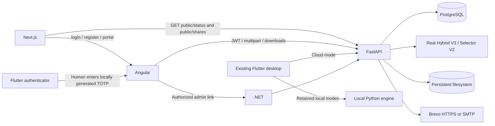

# XAI deployment and integration

No cloud services are deployed yet. All production URLs remain placeholders. Prior candidate xai-compress domains returned 404 and were reset after the user confirmed they are not deployments. Local integration tests do not establish cloud availability.

## Actual architecture and URL matrix

| Interface | Project root | URL variable | Development | Production |
|---|---|---|---|---|
| Public Next.js | apps/public_nextjs | NEXT_PUBLIC_SITE_URL | http://localhost:3000 | Actual Vercel public-site origin |
| Angular portal | apps/web_angular | NEXT_PUBLIC_APP_URL in public project | http://localhost:4200 | A separate Vercel portal origin |
| Backend | services/api_fastapi | INTERNAL_API_URL (Next.js); XAI_API_URL (portal/Flutter) | http://localhost:8000 | Actual Render HTTPS origin |
| Admin | apps/admin_dotnet | ADMIN_URL (portal); PlatformApi__BaseUrl and PortalUrl (admin) | http://localhost:5050 | Optional Render admin origin |
| PostgreSQL | Render-managed or Compose db | DATABASE_URL | db:5432 inside Compose | Render internal PostgreSQL URL |
| Storage | FastAPI filesystem | STORAGE_PATH | Named xai-storage volume at /data | Persistent disk mounted at /data |



The active architecture includes an internal ClamAV daemon and backend YARA scanning. It has no Keycloak identity service, compression-worker queue, MinIO client, or Grafana/ELK service. Authentication remains the repository's password/JWT/refresh-token/TOTP implementation. Mobile codes are generated offline after QR/manual enrollment.

## Environment files

Preserve these local, Git-ignored editable files and their committed `.example` counterparts:

- deployment/.env.vercel.public
- deployment/.env.vercel.portal
- deployment/.env.render.api
- deployment/.env.render.admin

Every variable has Used by, Example, Secret and Required comments. Import only the matching service file into that provider's environment settings. The platform does not automatically discover these named files. Real values belong in ignored files or provider secret settings, never examples. Backend APP_ENV=production rejects placeholder JWT/database configuration and non-HTTPS/development CORS origins. Development Compose retains local defaults.

## Exact deployment order

1. **Configure Brevo.** Create/verify the sender in Brevo and obtain a transactional API key. Set EMAIL_PROVIDER=brevo, BREVO_API_KEY and SMTP_FROM in .env.render.api. HTTPS uses `https://api.brevo.com/v3/smtp/email`, authenticated with the api-key header. SMTP remains available with EMAIL_PROVIDER=smtp, SMTP_HOST=smtp-relay.brevo.com, the Brevo SMTP username/key, and provider-supported SMTP_PORT/SMTP_SECURITY. API keys and SMTP keys are different credentials. Confirm current account quotas/transactional activation in Brevo. Free-tier availability does not establish delivery.

   **Exact-artifact blocker:** Brevo's current HTTPS API attachment extension allowlist does not include `.xaic`. The adapter refuses that extension and does not rename it or wrap/substitute ZIP. Provider support for the actual format is required before this exact .xaic email test can pass. SMTP format acceptance has not been tested. Missing credentials remain a separate blocker. No alternate compression or forged receipt is used.

2. **Deploy backend.** Create Render PostgreSQL and a Docker web service in the same region. Backend build root is repository root (Root Directory empty), Dockerfile `services/api_fastapi/Dockerfile`. Import .env.render.api. Convert the internal PostgreSQL URL scheme to `postgresql+psycopg://` for the installed psycopg 3 driver; preserve encoded credentials and any URL options. Generate a random JWT_SECRET locally, at least 32 characters. Health check is `/health`. Docker starts `uvicorn app.main:app --host 0.0.0.0 --port ${PORT:-8000}`. Render's PORT is honored; template uses 10000. Local Compose uses 8000.

   Attach a persistent disk at `/data`. The existing code stores both uploaded files and compressed artifacts there. Render free web services have ephemeral filesystems and no persistent disks. Brevo HTTPS avoids blocked SMTP ports but does not solve persistence. Use a single persistent-disk instance for the current architecture. Production startup does not call SQLAlchemy `create_all`: provision the base schema through the reviewed database bootstrap process and apply `services/api_fastapi/migrations/001_totp_enrollments.sql` before starting the new API. The migration is additive and idempotent, but it is not a substitute for provisioning a fresh base schema.

   **Admin role migration gate:** authorization now depends only on `users.role = 'admin'`; an `ADMIN_EMAILS` entry does not grant access. Before deploying this behavior, inspect the existing operator row without exporting credentials or tokens. Set `APP_ENV=production`, `XAI_SEED_ADMIN=true`, `XAI_SEED_ADMIN_EMAIL` to that existing operator email, and `XAI_SEED_ADMIN_PASSWORD` to a valid temporary bootstrap input supplied through the deployment secret store. With the migrated production schema available, run `python -m app.scripts.create_admin --promote-existing --allow-production-bootstrap` once in the API environment. For an existing user this changes only `role` to `admin`, preserves the existing password and MFA factor, and records `admin.bootstrap.promoted` in `audit_events`. Confirm the CLI reports `PROMOTED`, verify login and `/admin/stats`, then disable/remove all three `XAI_SEED_ADMIN*` values before normal startup. Do not update production rows manually and do not use the public registration endpoint for this promotion.

3. **Obtain backend HTTPS URL.** Verify its `/health` returns the XAI service and selector readiness. Do not use localhost, emulator gateways or Docker-private names for distributed clients. Propagate the actual URL:

   ```powershell
   .\.venv\Scripts\python.exe scripts/configure_deployment.py --api-url https://YOUR_ACTUAL_API.onrender.com
   ```

   This updates local URL fields only, preserving secrets. It does not deploy services or invent a domain.

4. **Configure CORS.** Use exact public/portal origins, no paths/trailing slashes, comma-separated. Production rejects HTTP origins and placeholders. Reserve/obtain the two Vercel project domains before configuring them. Add specific custom/preview origins only if they need API access; no wildcard with credentials. CORS is an origin policy, not authentication.

5. **Deploy public Next.js.** Vercel Root Directory `apps/public_nextjs`; install `npm ci`; build `npm run build`. Import .env.vercel.public. NEXT_PUBLIC_SITE_URL is the public site, NEXT_PUBLIC_APP_URL is the separate portal, INTERNAL_API_URL is the PUBLIC Render HTTPS backend origin. INTERNAL does not mean Render-private networking from Vercel. No secrets belong in NEXT_PUBLIC_*.

6. **Deploy Angular.** Vercel Root Directory `apps/web_angular`. Existing vercel.json uses `npm run build:vercel`, output `dist/xai-web/browser`, SPA fallback to index.html. Import .env.vercel.portal: XAI_API_URL, NEXT_PUBLIC_SITE_URL (return link), optional ADMIN_URL. The generator writes a production environment with HTTPS origins. Normal local production Docker builds use `/api` through nginx; Vercel builds call Render directly. Direct `/login`, `/register`, `/compress`, `/inbox`, `/security`, `/settings` routes must be verified after the real deployment.

7. **Configure all links.** Once URLs exist:

   ```powershell
   .\.venv\Scripts\python.exe scripts/configure_deployment.py --api-url https://YOUR_ACTUAL_API.onrender.com --public-url https://YOUR_PUBLIC.vercel.app --portal-url https://YOUR_PORTAL.vercel.app
   ```

   Add --admin-url only for a deployed admin. Re-import affected files and redeploy. Public header links to login/register/portal and docs/status. Portal links back to public site, shows Account/MFA data, and exposes Admin only when backend `/auth/me` reports is_admin. Admin uses PortalUrl to return to portal and PlatformApi__BaseUrl for server API requests. Backend authorization still enforces admin access regardless of link visibility.

8. **Build Android production package only after the API is real.** Correct Flutter SDK is C:\src\flutter and GRADLE_USER_HOME is E:\GradleCache. Configure XAI_ANDROID_KEYSTORE (absolute local path), XAI_ANDROID_STORE_PASSWORD, XAI_ANDROID_KEY_ALIAS and XAI_ANDROID_KEY_PASSWORD in the local build environment. These are signing secrets, not Render/Vercel variables. No keystore/password is generated by this task. Release cleartext HTTP is disabled; debug emulator HTTP remains enabled.

   ```powershell
   .\scripts\build_production.ps1 -Target android -ApiUrl https://YOUR_ACTUAL_API.onrender.com
   .\scripts\build_production.ps1 -Target android -ApiUrl https://YOUR_ACTUAL_API.onrender.com -Aab
   ```

   For explicit TEST distribution only, -AllowDebugSigning opts into the existing debug key. It is recorded as debug-signed and is not store signing. The helper verifies backend health first, runs `flutter build apk/appbundle --release --dart-define=XAI_API_URL=...`, and records path/size/hash under dist/production-artifacts. It does not produce a final release against placeholders. Install the APK on the actual phone with `adb -s DEVICE_ID install -r APK_PATH` after selecting the intended connected device. An AAB is a store bundle, not directly installable by adb.

9. **Build Windows production package after the real API exists.**

   ```powershell
   .\scripts\build_production.ps1 -Target windows -ApiUrl https://YOUR_ACTUAL_API.onrender.com
   ```

   This runs the existing desktop app's Windows release build, then packages the entire Release folder (EXE, DLLs and data). The ZIP is a Windows application distribution envelope, not a replacement for XAI compression. Release URL guards prohibit development fallback; persisted local API settings do not override the release URL. Desktop cloud mode uses the actual backend without requiring Python on the receiving PC; existing static/neural local modes remain available when Python/engine are configured. Sign in through Account / Receive before cloud operations. Windows binaries are unsigned unless an operator signs them separately. Do not copy the EXE alone. Build outputs stay on E:; the helper refuses to silently move an existing build directory.

10. **Test external devices.** Use a real Android phone on another network and another Windows PC. Check HTTPS login with mobile TOTP and cloud upload/download/decompression. No external-device readiness claim is made until those tests are run. Per the user's follow-up, final APK/AAB/Windows artifacts are deferred until cloud URLs exist.

11. **Email E2E.** The specific test email to m.taieb2k@gmail.com remains authorized; do not request that authorization again. First resolve Brevo .xaic support and sender credentials. Use the actual saved 633-byte artifact. Run `scripts/test_full_e2e.py --input dist/e2e-diagnostic/xai-e2e-original.bin --expected-artifact dist/e2e-diagnostic/xai-e2e-original.bin.xaic --api https://YOUR_ACTUAL_API.onrender.com`. It requires a mobile code, real provider acceptance and a genuine mailbox .eml export; no automatic inbox retrieval is implemented. Preserve Message-ID, filename and hash. Provider acceptance is not receipt.

12. **Final integrity verification.** Import the received attachment through Inbox or the desktop receive/decompression flow, use the real XAI engine, and require original/restored SHA-256 and bytes to match. Run the deployment checker:

   ```powershell
   .\.venv\Scripts\python.exe scripts/validate_production.py --api https://YOUR_ACTUAL_API.onrender.com --public https://YOUR_PUBLIC.vercel.app --portal https://YOUR_PORTAL.vercel.app
   ```

   Normal checks do not send email. --exercise-files prompts for an enrolled account and exercises real compression/decompression; administrator credentials allow the nonsecret email-configuration check. --send-email --input PATH explicitly invokes the full email/receipt test. NOT VERIFIED is not counted as PASS. Results are under dist/deployment-validation. For local diagnostics only, use --allow-local with localhost URLs.

## API route map

| Client use | Backend contract |
|---|---|
| Registration / login | POST /auth/register and /auth/login; JSON, optional TOTP at login |
| Account / refresh / logout | GET /auth/me, POST /auth/refresh, POST /auth/logout |
| Enrollment | POST /auth/totp/enroll; POST /auth/totp/confirm with JSON code; Bearer token |
| Upload | POST /compression/jobs; multipart upload; Bearer token |
| Owner artifact download | GET /files/{id}/download; binary, ownership enforced |
| Import/decompression | POST /compression/decompress; multipart upload; binary output/hash header |
| History | GET /history |
| Share metadata / download | POST /shares, POST /shares/redeem, POST /shares/download |
| Public share | GET /public/shares/{code} |
| Email | POST /files/{id}/email; JSON recipient_email; owner-only |
| Health / status | GET /health; GET /public/status |
| Admin | GET /admin/stats, /admin/users, /admin/jobs, /admin/audit, /admin/email/configuration |

Share metadata inspection no longer consumes download quota. Actual shared downloads increment quota atomically and enforce recipient, expiration and revocation. Email provider returns accepted_by_smtp or accepted_by_provider; neither is delivery proof.

## Monitoring semantics

/public/status exposes only status and fixed service names with operational/degraded/unavailable/unknown values. It checks database connectivity, engine configuration readability and filesystem readiness without sending mail or writing probe files. Notifications are degraded when unconfigured and unknown when configured because credentials alone do not prove provider uptime. The page uses no-store fetch with timeout and reports unavailable/unknown on backend failure. Storage readiness is not a persistence guarantee. Private hosts, credentials, stack traces and environment values are not returned. The admin email configuration route exposes missing variable NAMES, never values, and requires admin authorization.

## Official references

- Brevo API and attachment allowlist: https://developers.brevo.com/reference/send-transac-email
- Brevo SMTP settings: https://help.brevo.com/hc/en-us/articles/7924908994450-Send-transactional-emails-using-Brevo-SMTP
- Render SMTP/persistence restrictions: https://render.com/docs/free
- Render disks: https://render.com/docs/disks
- Render Postgres: https://render.com/docs/postgresql-creating-connecting
- Vercel environment variables: https://vercel.com/docs/environment-variables
- Angular environment file replacement: https://angular.dev/tools/cli/environments

See docs/DEPLOYMENT_INTEGRATION_REPORT.md for the actual run results, modified files and remaining blockers. This guide is not evidence of a deployed service or a successful email.
